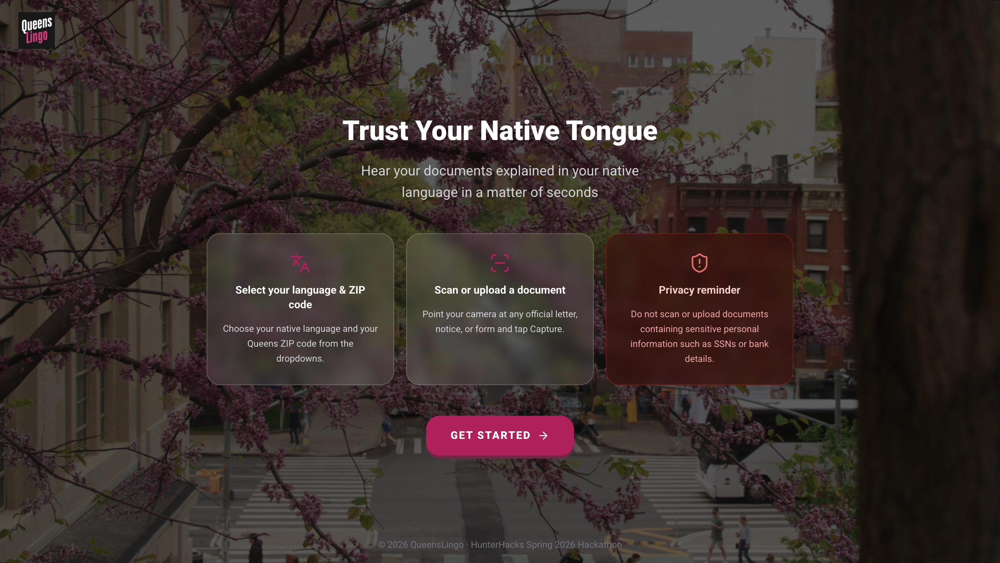

# QueensLingo - Multilingual Document Assistant 

## What It Does

QueensLingo is an AI powered tool to help immigrants understand legal documents that contains thick English that may be hard to understand. 

1. **Capture** — point your phone camera at any official document, or upload an image
2. **Analyze** — Gemini 2.5 Flash model extracts and understands the document
3. **Explain** — returns a plain-language explanation, action steps, and urgency level in the user's native language
4. **Listen** — ElevenLabs reads the explanation aloud in that language
5. **Connect** — Google Places surfaces 3 real nearby organizations that can help, with maps and directions

This multilingual tool aims to help immigrants navigate their new life in a comforting and easier to understand way. 

---

## Video Demo
<div style="width:100%;">
  <a href="https://vimeo.com/1186696712?share=copy&fl=sv&fe=ci">
    
  </a>
</div>

---

## Tech Stack

| Layer | Technology |
|---|---|
| Framework | Next.js 14 (App Router, TypeScript) |
| Styling | Tailwind CSS + shadcn/ui |
| AI / Vision | Google Gemini 2.5 Flash |
| Text-to-Speech | ElevenLabs `eleven_multilingual_v2` |
| Maps & Places | Google Maps + Places API |
| Deployment | Vercel |

---

## Supported Languages

Spanish, Chinese, Hindi, French, Arabic, Portugese, Russian, Korean, Japanese, German, Italian, Turkish, Polish, Ukranian, Filipino, Tamil 

> The following languages are supported but for these text-to-speech is NOT available: Malayalam, Dari, Bengali, Urdu, Gujarati, Punjabi. All other functionality is still available. 

---

## How It Works

```
User selects/enters their native language + zipcode
        ↓
User captures image or uploads file of document
        ↓
The base64 image is passed to Gemini AI via a POST request
        ↓
The AI returns a JSON object which contains with the following keys: document type, translated-explanation, next-steps, urgency, keywords-for-resources
        ↓
NextStepsPanel displays the document type, translated explanation, and next step. This panel also renders an audio player once Elevenlabs returns the audio file containing the text to speech. Simultaneously as this Panel is rendered so is a ResourceGrid containing 3 ResourceCards of neraby relevant organization. Each card has the name, location, image, and get directions direct link. 
```

---

## Project Structure

```
queenslingov2/
├── app/
│   ├── page.tsx                      # Landing page
│   ├── dashboard/page.tsx            # Main dashboard (owns all state)
│   └── api/
│       ├── analyze/route.ts          # POST: image → Gemini → AnalysisResult
│       ├── tts/route.ts              # POST: text → ElevenLabs → audio/mpeg
│       └── resources/route.ts        # GET: keywords + zipcode → Google Places
├── components/
│   ├── dashboard/
│   │   ├── LanguageZipSelector.tsx
│   │   ├── CameraCapture.tsx
│   │   ├── NextStepsPanel.tsx
│   │   ├── ResourceCard.tsx
│   │   └── ResourceGrid.tsx
│   └── ui/                           # shadcn/ui components
├── lib/
│   ├── gemini.ts                     # analyzeDocument()
│   ├── elevenlabs.ts                 # synthesizeSpeech()
│   ├── places.ts                     # fetchNearbyResources()
│   ├── languages.ts                  # Supported language list
│   └── zipcodes.ts                   # Queens zipcodes
└── types/index.ts                    # Shared TypeScript types
```

---

## Developer Notes

- Developer: [Alfred Siby Cyriac](https://www.linkedin.com/in/alfredsiby-cyriac/)
- Developer: [Sharif Ali](https://www.linkedin.com/in/sharif-ali1/)
